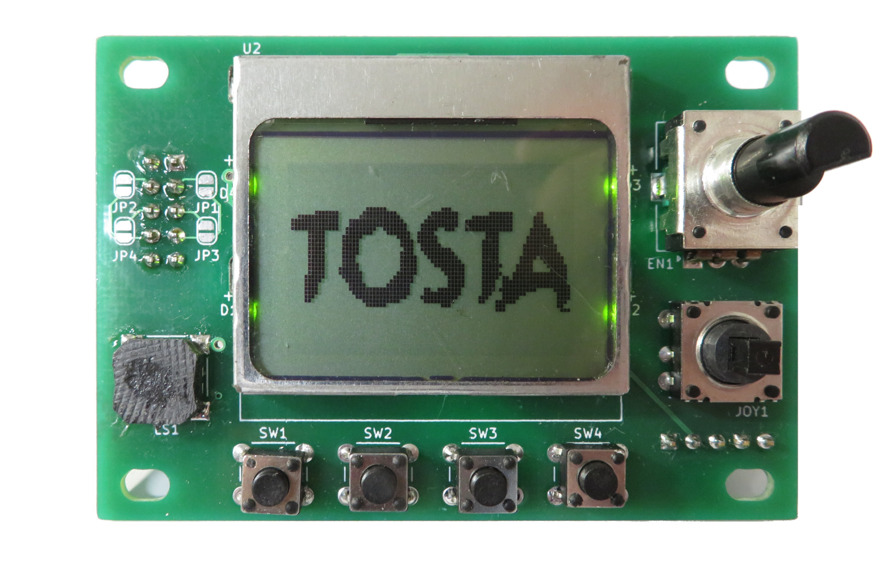
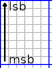
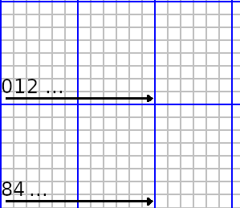
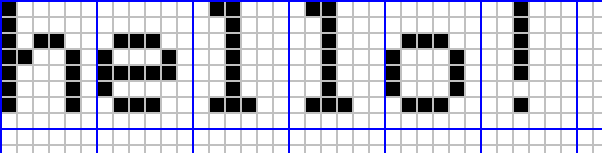
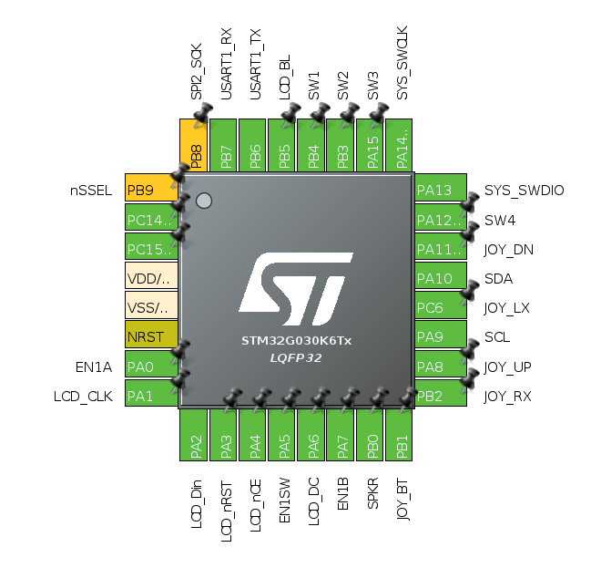
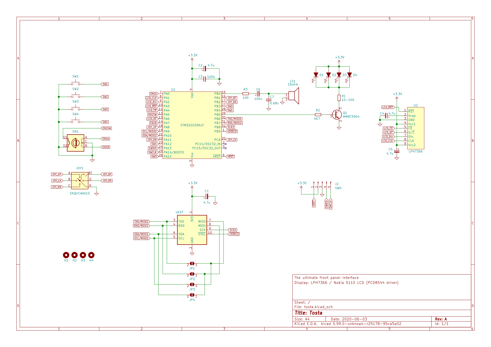
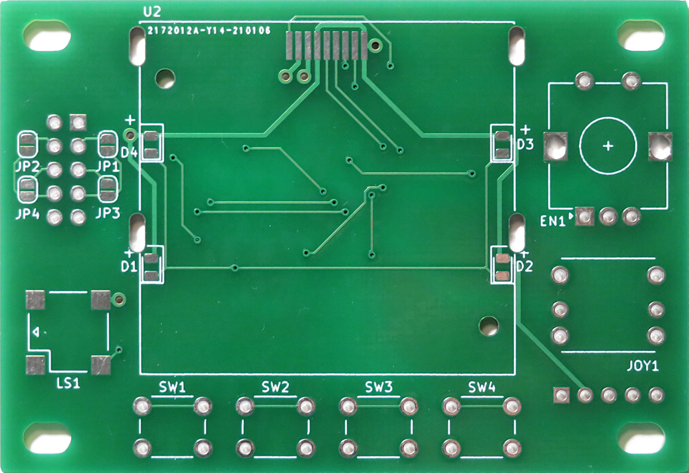
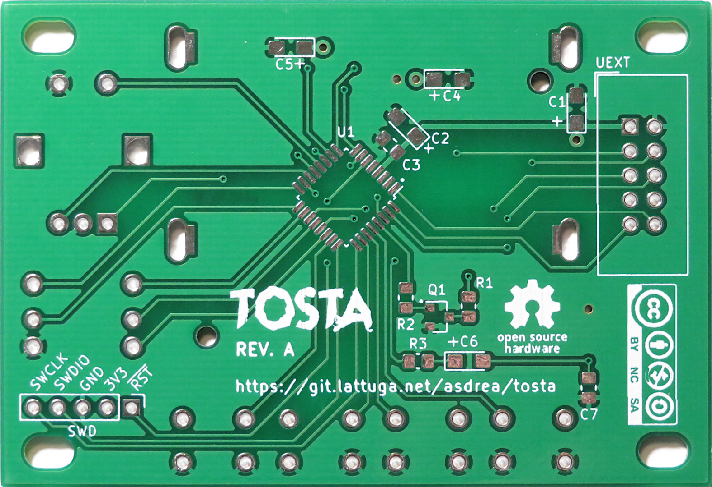

# Tosta

Tosta is a **low-power terminal interface module** built around the [STM32G030](docs/STM32G0x0.pdf) microcontroller. The module features:

- 48x84 monochrome pixel matrix (Nokia 5510 LCD using [PCD8544](docs/PCD8544.pdf) controller)
- configurable dimmable backlight
- configurable display standby timer
- a rotary encoder with central switch
- a D-Pad joystick with central switch
- 4 tactile switches
- a speaker
- an UART interface @ 115200 baud/s
- an I2C slave interface @ 400KHz (address 0x7D)
- 150uA consumption in standby mode



## User guide

The main communication interface (characters based) is UART @ 115200 baud/s.
I2C (binary based) is used for fast display update among other things.

### UART Inputs

When the module receive an input, it send a corresponding command character as
follows:

Event                        | Hex  | Char
---------------------------- | ---- | ----
SW1 pressed                  | 0x41 | A
SW1 released                 | 0x61 | a
SW2 pressed                  | 0x42 | B
SW2 released                 | 0x62 | b
SW3 pressed                  | 0x43 | C
SW3 released                 | 0x63 | c
SW4 pressed                  | 0x44 | D
SW4 released                 | 0x64 | d
D-Pad button pressed         | 0x45 | E
D-Pad button released        | 0x65 | e
D-Pad left pressed           | 0x46 | F
D-Pad left released          | 0x66 | f
D-Pad right pressed          | 0x47 | G
D-Pad right released         | 0x67 | g
D-Pad up pressed             | 0x48 | H
D-Pad up released            | 0x68 | h
D-Pad down pressed           | 0x49 | I
D-Pad down released          | 0x69 | i
Encoder button pressed       | 0x4A | J
Encoder button released      | 0x6A | j
Encoder turn clockwise       | 0x2B | +
Encoder turn anti-clockwise  | 0x2D | -

### Display matrix

The display matrix comprises 84 horizontal by 48 vertical pixels.
Each individual pixel is either *on* (1) or *off* (0) which corresponds to the
status of a single bit. Individual bits are grouped into bytes, representing
a sub-column of 8 pixels.



The next byte is the nearby sub-column, on the right side. The display
frame buffer contains a total 504 bytes: 84 for the upper sub-columns, 84 for
the next ones and so on, for a total of 6 (84x6 bytes, row-major ordering).



Characters are a logical subdivision into a 14x6 matrix, in which each cell is
a 6x8 pixels sub-matrix (see blue lines).



```
h   0x7f 0x08 0x04 0x04 0x78 0x00
e   0x38 0x54 0x54 0x54 0x18 0x00
l   0x00 0x41 0x7f 0x40 0x00 0x00
l   0x00 0x41 0x7f 0x40 0x00 0x00
o   0x38 0x44 0x44 0x44 0x38 0x00
!   0x00 0x00 0x5f 0x00 0x00 0x00
```

### UART outputs

Writing characters works as usual on a *tty* device, using standard ASCII
encoding (printable characters from 0x20 up to 0x7F). There are few special
characters:

- `\a` (bell): play a C4 note from the speaker for 250ms
- `\b` (backspace): delete the last displayed character
- `\n` (line feed): newline
- `\f` (form feed): clear screen
- `\r` (carriage return): move cursor to the beginning of the current line

The user can also add non-standard custom characters (from 0x80 to 0xFF) using
[parametric escape sequences](#escape-sequences).

#### Escape sequences

Escape sequences are used to obtain special behaviours. In order to start
an escape sequence, the special character `\e` (or `\x1B` or `\033`) must be
used.

Basic sequences are:

Sequence | Effect
-------- | ---------------------------------
`\es`    | Put the display in standby
`\ew`    | Wake up the display from standby
`\el`    | Display an awesome logo

Advanced sequences allow passing numerical parameters, and they're started
using `\e[` (i.e. `\x1B[` or `\033[`).

Sequence                           | Effect
-----------------                  | ------------------------------------------------------------
`\e[`N`b`                          | Set display backlight brightness, with *N in [0, 127]*
`\e[`N`,`A`,`B`,`C`,`D`,`E`,`F`c`  | Set user character *N*, specifying bytes in the character sub-matrix from left to right (*N in [128, 255]*; *A,B,C,D,E,F in [0, 255])*
`\e[`F`,`T`p`                      | Play sound (immediate) having frequency *F* for *T* milliseconds
`\e[`F`,`T`q`                      | Enqueue sound playing with frequency *F* for *T* milliseconds
`\e[`T`s`                          | Set the display standby timer in *T* milliseconds (0 to disable standby)
`\e[`X`,`Y`z`                      | Set cursor position to *X in [0, 13]* and *Y in [0, 5]*

##### Example

```sh
stty -F /dev/ttyUSB0 115200
echo -ne "\e[128,12,30,60,30,12,0c" >>/dev/ttyUSB0
echo -ne "\f\x80\x80\x80\x80\x80\x80\x80\x80\x80\x80\x80\x80\x80\x80Frere Jacques\n\x80\x80\x80\x80\x80\x80\x80\x80\x80\x80\x80\x80\x80\x80" >>/dev/ttyUSB0
echo -ne "\e[1047,500q\e[1175,500q\e[1319,500q\e[1047,500q\e[1047,500q\e[1175,500q\e[1319,500q\e[1047,500q\e[1319,500q\e[1397,500q\e[1568,500q\e[0,500q\e[1319,500q\e[1397,500q\e[1568,500q" >>/dev/ttyUSB0
```

### I²C

- Send 1 byte to address 0x7D for command (0), necessary to wake the MCU from stop mode nicely
- Send the framebuffer (504 bytes) to address 0x7D
- ...

## Firmware

Firmware is written using the [STM32 Cube IDE](https://www.st.com/en/development-tools/stm32cubeide.html).



### Peripherals assignment:

- TIM1: speaker PWM
- TIM3: LCD backlight PWM
- TIM14: Inputs debounce
- SPI1+DMA: LCD data output
- UART: main serial communication interface
- I2C1: secondary communication interface (slave)

## Hardware







## Trivia

```C
0x7D == ('t' ^ 'o' ^ 's' ^ 't' ^ 'a')
```
